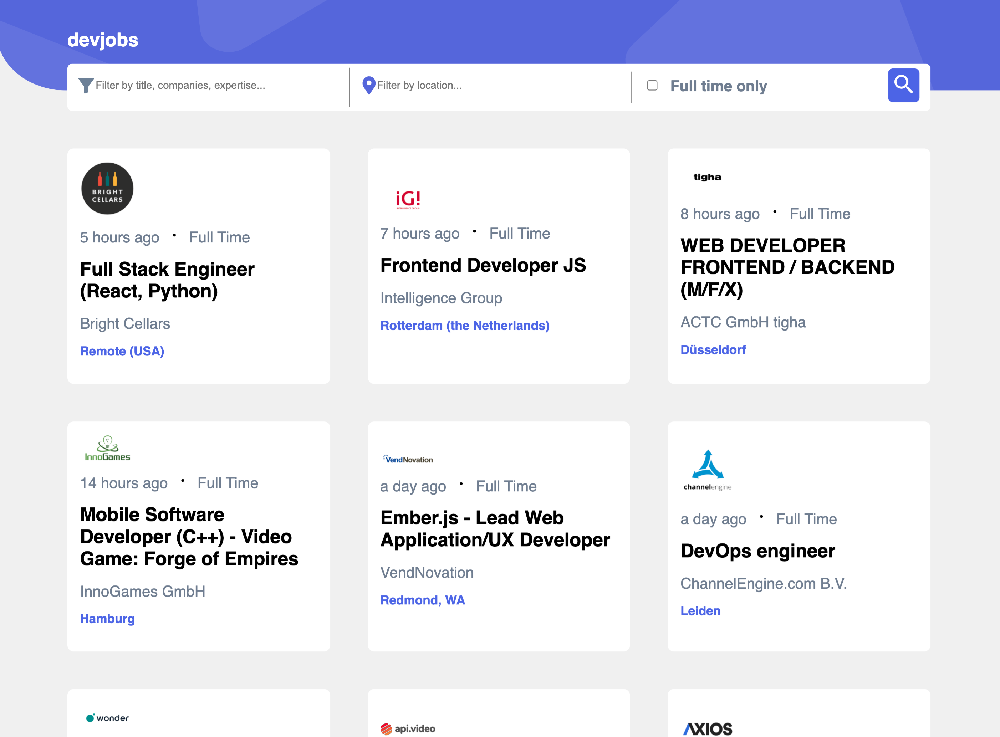

# GitHub Jobs Viewer

- View all jobs currently live on the GitHub Jobs API
- Filter by title, companies, expertise, location, and full-time only.
- Click a job to open modal and read more information to apply for the job.
- Single-page Application built with React, Styled components, axios API.

To run locally:

1. Download repository with `git clone https://github.com/jianninetorres/github-jobs-api.git` .
2. In project directory, run `yarn start` .
3. Go to `http://localhost:3000/` in your browser.
